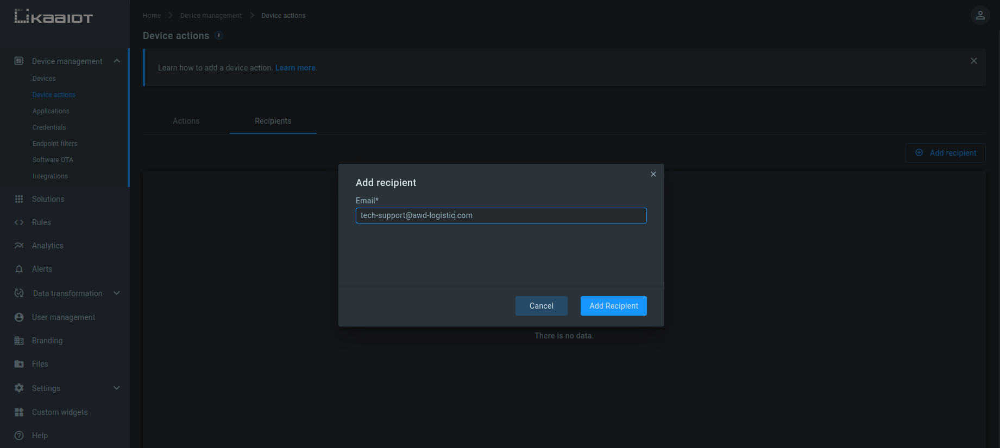
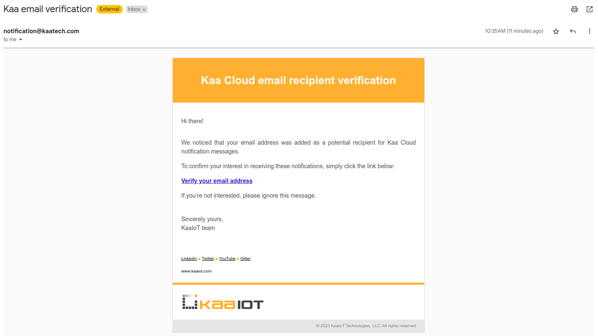
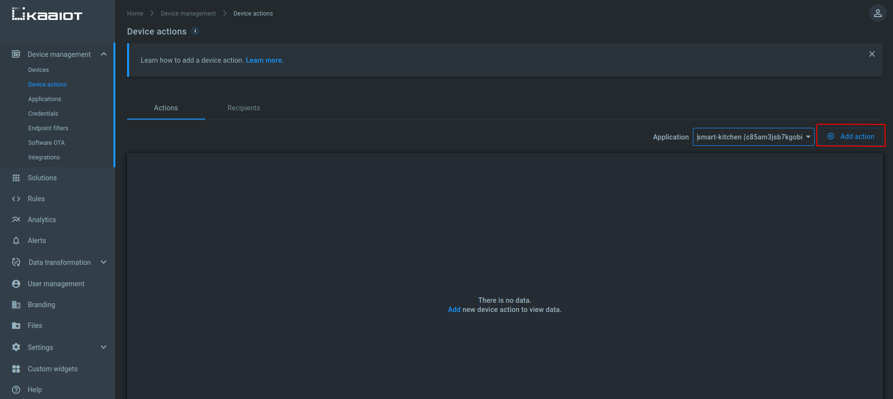
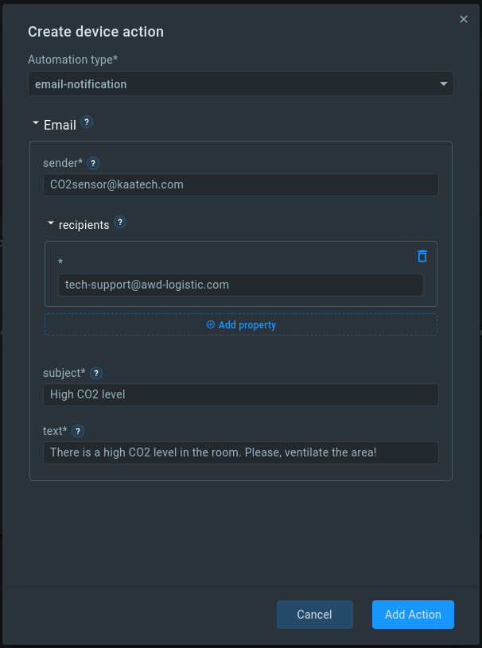
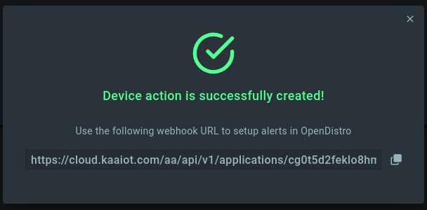




* TOC
{:toc}

Time to complete: *17 min*.


## Overview

Welcome to the fifth tutorial in the Kaa getting started guide!
We assume that you have successfully [connected your first device][connecting your first device] to Kaa, [collected data from a device][collecting data from a device], and [sent alerts with Open Distro][open distro alerting tutorial] so make sure to review those tutorials before proceeding here.

From this tutorial, you will learn how to configure a webhook destination for Open Distro that will be triggered to send an email when a certain telemetry value from the endpoint exceeds a defined threshold.

We will use Kaa SMTP server.


## Open Distro integration

Open Distro is an open-source distribution of Elasticsearch with advanced security, alerting, SQL support, automated index management, deep performance analysis, and [more][open distro documentation].
Kaa forwards all telemetry data from your endpoints into [Elasticsearch index](https://www.elastic.co/blog/what-is-an-elasticsearch-index) attached to your tenant.


## Playbook


### Create an email recipient

The device action we will create is a sending email notification.
But before the beginning creation of this action, we have to add and verify the recipients we are going to use in the action.
This procedure allows us to be sure that the email notification will be delivered to the recipient who is waiting for it.

To add the recipients go to the Recipients and press the **Add recipient** button. 
After that please enter the desired recipient and press **Add recipient** button.



Now you can see that the email notification recipient was added, but it has unverified status.


Please check your email. The email to verify your mailbox as email recipient must arrive.

> Note: if the verification email is absent please check that you add the correct email recipient and please check your Spam email folder. 
{:.note}


The verification email looks like:



Please press the link **Verify your email address** to verify your email and check that the email recipient is verified.


### Create a device action

After the previous step can create a device action.
 
Go to the ["Device actions" dashboard][device actions dashboard] and choose your application.



Here you can create the action - the webhooks that perform some actions when triggered.  
You can add these webhooks as triggers in Open Distro - and the action you choose will be executed as soon as the condition specified in Open Distro is met.

Click the "Add action" button.



Here you can choose an automation type.  
In our case, it is an **email-notification**.  
Specify the required parameters of the automation type you have chosen.

> - the **sender** hostname must be the SMTP server hostname. 
> In our case when we use the Kaaiot cloud hostname must be **kaaiot.com**
> - as a recipients we can use only previously verified recipients



### Webhook body

The webhook message body is JSON. There are some variants:

- webhook body can contain empty JSON. For example:
```json
{}
```

In order to test that the webhook works and emails are sent, you can call the provided webhook directly, for example, using Postman, cURL, or any other HTTP client you like.


The received message looks like:


- webhook body can contain just the message. For example:

```json
{
  "message": "The sensor in the machine room has high CO2 level"
}
```

The received message looks like:


- webhook body can contain the message with parameters. For example:

```json
{
  "params": {
    "Monitor": "CO2 level monitor",
    "Trigger": "Notification",
    "Severity": "2",
    "Period_start": "2023-03-13T13:07:39.665Z",
    "Period_end": "2023-03-13T13:06:39.665Z"
  },
  "message": "The sensor in the machine room has high CO2 level"
}
```

The received message looks like:


- webhook body can contain information about endpoints that were the reason of webhook execution (the most expanded message). For example:

```json
{
  "endpointIds": [
    {
      "endpoint_id": "12e0e834-3f0e-43c6-b6ab-491a71cde112",
      "params": {
        "name": "machine room CO2 sensor",
        "value": "73",
        "link": "https://cloud.kaaiot.io/devices/device-management/bsil512ikfmmfgrjhvog/devices/12e0e834-3f0e-43c6-b6ab-491a71cde112"
      }
    }
  ]
}
```

The received message looks like:


- webhook body can contain information about endpoints that were the reason of webhook execution and parameters (the most expanded message). For example:

```json
{
  "params": {
    "Monitor": "CO2 level monitor",
    "Trigger": "Notification",
    "Severity": "2",
    "Period_start": "2023-03-13T13:07:39.665Z",
    "Period_end": "2023-03-13T13:06:39.665Z"
  },
  "endpointIds": [
    {
      "endpoint_id": "12e0e834-3f0e-43c6-b6ab-491a71cde112",
      "params": {
        "name": "machine room CO2 sensor",
        "value": "73",
        "link": "https://cloud.kaaiot.io/devices/device-management/bsil512ikfmmfgrjhvog/devices/12e0e834-3f0e-43c6-b6ab-491a71cde112"
      }
    }
  ]
}
```

The received message looks like:


### Create webhook destination

We assume that you have already created a CO2 monitor and trigger during completing the previous [Open Distro Alerting][open distro alerting tutorial] tutorial so that your monitor looks next:

```sql
WHEN max()
OF dataSample.co2
OVER all documents
FOR THE LAST 1 minute(s)
WHERE dataSample.co2 is greater than 1000
```

and trigger is `IS ABOVE 1,000`.

If you don't have the above monitor and trigger, go to the [Open Distro Alerting][open distro alerting tutorial] and create them.
It won't take much time.

> Note that we use the message template from the [Open Distro Alerting][open distro alerting tutorial] the message text will contain just the message that was entered during the webhook creation.
But for the email alerting, there is a possibility to add dynamic information about endpoints that triggered an alert (read above about webhook body).
{:.note}

To use this feature, return to the monitor configuration and select **Define using extraction query** for the **How do you want to define the monitor?** field.
If the **size** query parameter doesn't have a zero value then the query result contains information that will be used by the message template to create a message text.
It is desirable to set the **size** value not less than the expected count of events that could be covered in the current query.

<br/>

To create a webhook destination, go to **Alerting**, **Destination**, and click **Add destination** button.


Enter "Email destination" into the **Name** field.
Select **Custom webhook** for the **Type** field.
Go to the device actions page and copy the link to the webhook, you created earlier.
Paste the link in the **Webhook URL** placeholder.


Click **Create**.

Go to **Monitors**, click on your monitor (it was named **CO2 level monitor** in the previous tutorial), find the **CO2 level trigger**, select it, and click **Edit**.
Scroll to the bottom and click **Add action**.

Enter "Email action" for the **Action name** field.
Select just created **Email destination** for the destination field.

If you didn't change the **size** query parameter, and we want to have just a simple notification message then we can use the next message template: 

```json
{"message":"CO2 level is {{ctx.results.0.aggregations.when.value}} ppm"}
```

Otherwise, if the **size** query parameter is not zero it is possible to add some additional information to the email message. 
In such a case we could use the following message template:

```json
{
    "params": {
        "Monitor": "{{ctx.monitor.name}}",
        "Trigger": "{{ctx.trigger.name}}",
        "Severity": "{{ctx.trigger.severity}}",
        "Period_start": "{{ctx.periodStart}}",
        "Period_end": "{{ctx.periodEnd}}"
    },
    "endpointIds": [
        {{#ctx.results.0.hits.hits}}
        {
            "endpoint_id": "{{_source.endpointId}}",
            "params": {
                "link": "https://cloud.kaaiot.com/devices/device-management/{{_source.appName}}/devices/{{_source.endpointId}}",
                "metadata": "{{_source.dataSample.~ep-metadata}}"
            }
        },
        {{/ctx.results.0.hits.hits}}
        {"endpoint_id": "", "params": {}}
    ]
} 
``` 

In such a case, the email message will contain more detailed information about the event and a list of endpoints that relate to the event.

> Note that fields under the "endpointIds.params" path are optional. 
This example contains the direct link to the endpoint and the endpoint metadata.
For the endpoint metadata to be available enable the data sample enrichment with endpoint metadata for the application as in the screenshot below.
{:.note}


Now that setup is done, click **Send test message** to test the integration.


The mail must arrive at the email address, you've specified in the device action.


### Report high CO2 level

Let's report that CO2 equals 1200 and see what happens.

Simulate a high CO2 level by invoking the next `cURL`.
Don't forget to replace `<app-version-name>` and `<endpoint-token>` with your application version name and the endpoint token respectively.

```bash
curl --location --request POST 'https://connect.cloud.kaaiot.com:443/kp1/<app-version-name>/dcx/<endpoint-token>/json' \
--data-raw '{
  "co2": 1200
}'
``` 

In case you configured the destination with additional context, you can test it with the following example.

```bash
curl --location --request POST 'https://connect.cloud.kaaiot.com:443/kp1/<app-version-name>/dcx/<endpoint-token>/json' \
--data-raw '{
    "endpointIds": [
      {
        "endpoint_id": "0e12e834-3f0e-43c6-abb6-49e11cd121a7",
        "params": {
          "deviceState": "RUNNING",
          "co2": "1200"
        }
      }
    ]
}'
```

Within a minute you should receive an alerting mail.

### View alerts history

To view alert history, go to the alerting dashboard.


## Learn more

- Check out the webinar where we explained Open Distro analytics and alerts in more details: [Data Analytics and Notifications][webinar Data Analytics and Notifications]
- Learn [Open Distro documentation][open distro documentation] and get deep insights into your IoT data


## Feedback

This tutorial is based on Kaa 1.5.
If you, our reader from the future, spot some major discrepancies with your current version of the Kaa platform, or if anything does not work for you, please [give us a shout][Kaa user chat] and we will help!

And if the tutorial served you well, we'd still love to hear your feedback, so [join the community][Kaa user chat]!

<br/>
<div style="display: flex; justify-content: space-between;">
<div>
<a class="free_trial__button" href="{{sending_commands_to_device}}"><< Sending commands to device</a>
</div>
<div>
<a class="free_trial__button" href="{{authenticating_client_with_tls_certificate}}">Authenticating client with TLS certificate >></a>
</div>
</div>


[open distro documentation]: https://opendistro.github.io/for-elasticsearch-docs/
[create monitor]: https://opendistro.github.io/for-elasticsearch-docs/docs/alerting/monitors/#create-monitors
[create trigger]: https://opendistro.github.io/for-elasticsearch-docs/docs/alerting/monitors/#create-triggers
[create destination]: https://opendistro.github.io/for-elasticsearch-docs/docs/alerting/monitors/#create-destinations
[create action]: https://opendistro.github.io/for-elasticsearch-docs/docs/alerting/monitors/#add-actions
[slack webhook]: https://api.slack.com/messaging/webhooks
[device actions dashboard]:  https://cloud.kaaiot.com/devices/device-actions
